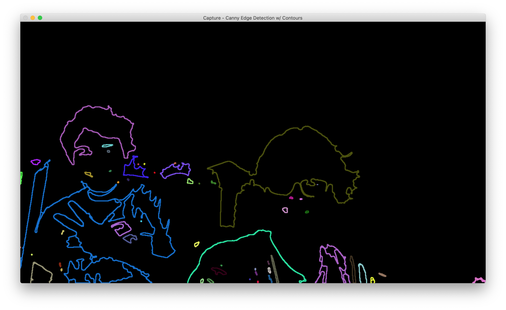
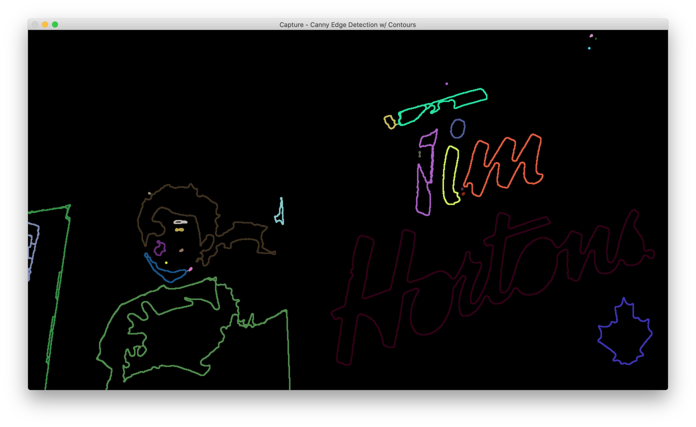
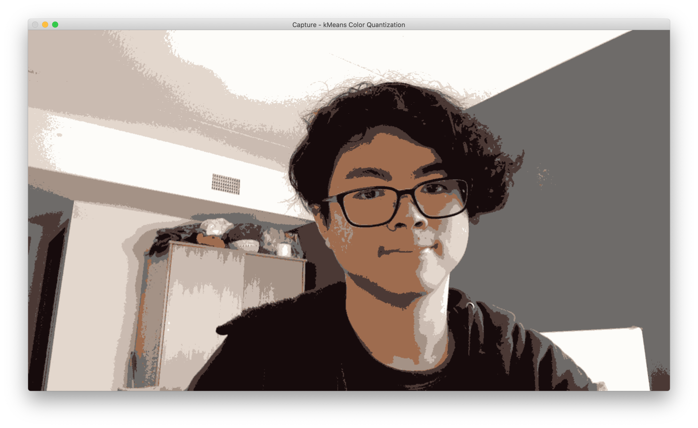

# facial-recognition
Brief demo for facial recognition using C++

## Overview

I have created 3 demos so far, piecing together information from opencv's thorough documentation: https://docs.opencv.org/

### `faceDetection()`


This uses a Haar Cascade Frontal Face Classifier to detect faces in the image, and draw a bounding box around them.

### `cannyEdgeDetection()`



This takes the maximum intensity point in the image, and takes a fraction of that to take the threshold value (this makes sure that it works in all lighting). Once the threshold is created, a binary image is created, and is passed through the Canny Edge Detection algorithm. After that, all contours are found in the image, randomly assigned a color, and output to a matrix of the same size.

### `colorThreshold()`


This uses the kmeans algorithm to cluster similar colors. The 3 channel colors are compressed into a 3-wide matrix, the kmeans algorithm is applied, and pixels are replaced with their center values.

Read more: https://docs.opencv.org/master/d1/d5c/tutorial_py_kmeans_opencv.html

## Installing OpenCV using CMake on MacOS

I found there was a lack of documentation on configuring CMake without tools from heavily integrated IDE's such as Visual Studio and XCode, so I've outlined how I have been able to set up OpenCV on my Mac.  

```
# Ensure CMake is installed/up to date (you need homebrew for this)
brew install cmake

# Enter your project directory
cd <project directory>

# Pull opencv files from github
git clone https://github.com/opencv/opencv.git
git clone https://github.com/opencv/opencv.git

# Make temporary build locations
mkdir install build_opencv

# Build in the build_opencv location
cd build_opencv
cmake -D CMAKE_BUILD_TYPE=RELEASE \
      -D CMAKE_INSTALL_PREFIX=../install \
      -D INSTALL_C_EXAMPLES=ON \
      -D OPENCV_EXTRA_MODULES_PATH=../opencv_contrib/modules \
      -D BUILD_EXAMPLES=ON ../opencv

# Build opencv
export CPUS=$(sysctl -n hw physicalcpu)
make -j $CPUS
make install
```

I believe now you no longer need the `opencv` and `build_opencv` directories. For cleanliness you can remove them with `rm -r`.  

After that, create a `CMakeLists.txt` file to generate your Makefile, which should look like this:
```
# CMakeLists.txt

# Change this version to your current version
cmake_minimum_required(VERSION "3.15")

project(facial-recognition)

# set OpenCV_DIR variable equal to the path to the cmake
# files within the previously installed opencv program
set(OpenCV_DIR ./install/lib/cmake/opencv4)

# Tell compiler to use C++ 14 features which is needed because
# Clang version is often behind in the XCode installation
set(CMAKE_CXX_STANDARD 14)

# configure the necessary common CMake environment variables
# needed to include and link the OpenCV program into this
# demo project, namely OpenCV_INCLUDE_DIRS and OpenCV_LIBS
find_package( OpenCV REQUIRED )

# tell the build to include the headers from OpenCV
include_directories( ${OpenCV_INCLUDE_DIRS} )

# specify the executable target to be built
add_executable(facial-recognition main.cpp)

# tell it to link the executable target against OpenCV
target_link_libraries(facial-recognition ${OpenCV_LIBS} )
```

### References

Official: https://docs.opencv.org/master/d0/db2/tutorial_macos_install.html  
Full: https://thecodinginterface.com/blog/opencv-cpp-vscode/
